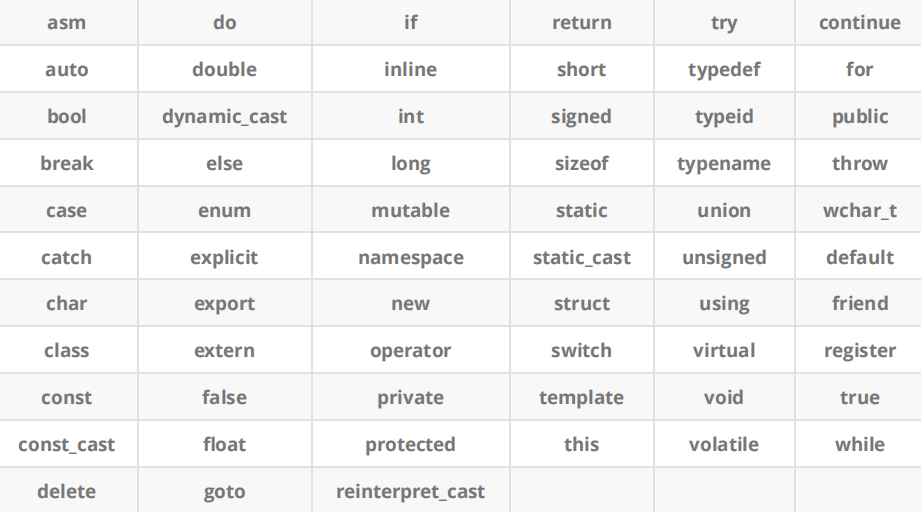

## 目录 - C++基础
- [目录 - C++基础](#目录---c基础)
- [C++关键字](#c关键字)
- [命名空间](#命名空间)
- [C++输入\&输出](#c输入输出)
- [缺省参数](#缺省参数)
- [函数重载](#函数重载)
- [内联函数](#内联函数)
- [auto关键字(C++11)](#auto关键字c11)
- [指针空值---nullptr(C++11)](#指针空值---nullptrc11)

## C++关键字

C++总计63个关键字，C语言32个关键字，大致了解一下就好了，后续使用的时候会自动熟悉的



## 命名空间

在C/C++中，变量、函数和后面要学到的类都是大量存在的，这些变量、函数和类的名称将都存
在于全局作用域中，可能会导致很多冲突。使用命名空间的目的是对标识符的名称进行本地化，
以避免命名冲突或名字污染，namespace关键字的出现就是针对这个的

**注意**：一个命名空间就定义了一个新的作用域，命名空间中的所有内容都局限于该命名空间中

```cpp
namespace bit {
    int a = 0;
    int b = 1;
    //可以是变量函数类型
    int Add(int x, int y) {
        return x + y;
    }

    struct Point {
        int x;
        int y;
    };
}
#include <stdio.h>
// 使用using namespace 命名空间名称 引入
using namespace bit;
int main() {
    printf("%d\n", bit::a);
    int b = Add(20, 30);
    return 0;
}
```
命名空间的使用还可以:
加命名空间名称及作用域限定符
```cpp
int main() {
    printf("%d\n", Name::a);
    return 0;
}
```

或者：
使用using将命名空间中某个成员引入 
```cpp
using Name::b
```

## C++输入&输出

使用cout标准输出对象(控制台)和cin标准输入对象(键盘)时，必须包含< iostream >头文件以及按命名空间使用方法使用std。

cout和cin是全局的流对象，endl是特殊的C++符号，表示换行输出，他们都包含在包含< iostream >头文件中。

<<是流插入运算符，>>是流提取运算符。

使用C++输入输出更方便，不需要像printf/scanf输入输出时那样，需要手动控制格式。

C++的输入输出可以自动识别变量类型

```cpp
#include <iostream>  // 引入输入输出流库，包含 cin 和 cout
using namespace std; // 使用标准命名空间，避免每次都写 std::

int main()           // 程序入口函数
{
    int a;           // 定义一个整数变量
    double b;        // 定义一个双精度浮点数变量
    char c;          // 定义一个字符变量
    // 从标准输入读取数据，自动匹配变量类型
    cin >> a;        // 读取一个整数到变量 a
    cin >> b >> c;   // 连续读取一个浮点数和一个字符
    // 输出数据到标准输出
    cout << a << endl;         // 输出整数 a 并换行
    cout << b << " " << c;     // 输出浮点数 b、空格和字符 c
    return 0;                  // 程序正常结束返回 0
}
```

## 缺省参数

缺省参数是声明或定义函数时为函数的参数**指定一个缺省值**。在调用该函数时，如果没有指定实参则采用该形参的缺省值，否则使用指定的实参。

通俗点就是设定几个默认值，可以选择性传参

```cpp
void func(int a = 0) {
    cout << a << endl;
}

int main() {
    func();     //没有传参的时候使用默认的参数
    func(10);   //传参时使用指定的参数
}
```
全缺省参数

```cpp
void Func(int a = 10, int b = 20, int c = 30)
 {
     cout<<"a = "<<a<<endl;
     cout<<"b = "<<b<<endl;
     cout<<"c = "<<c<<endl;
 }
```
半缺省参数

```cpp
void Func(int a, int b = 10, int c = 20)
 {
     cout<<"a = "<<a<<endl;
     cout<<"b = "<<b<<endl;
     cout<<"c = "<<c<<endl;
 }
```

1. 半缺省参数必须从右往左依次来给出，不能间隔着给
2. 缺省参数不能在函数声明和定义中同时出现

## 函数重载
## 内联函数
## auto关键字(C++11)
## 指针空值---nullptr(C++11)

