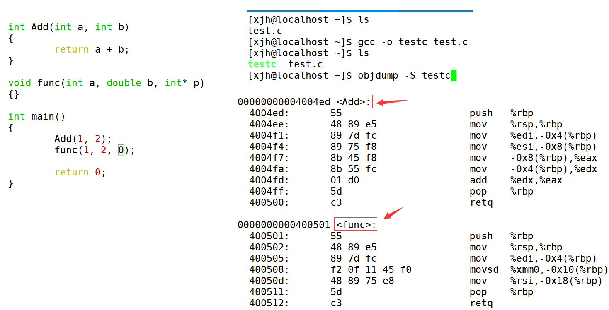
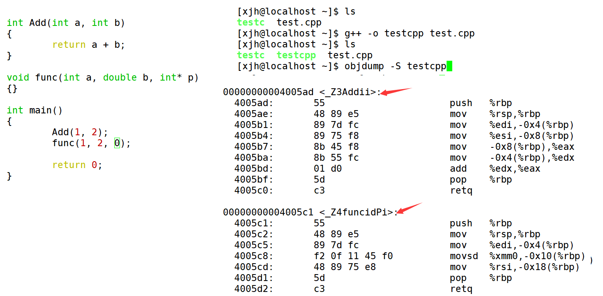

## 目录 - C++基础
- [目录 - C++基础](#目录---c基础)
- [C++关键字](#c关键字)
- [命名空间](#命名空间)
- [C++输入\&输出](#c输入输出)
- [缺省参数](#缺省参数)
- [函数重载](#函数重载)
  - [c语言的预处理](#c语言的预处理)
  - [c语言和c++的函数名修饰规则](#c语言和c的函数名修饰规则)
- [引用](#引用)
  - [概念](#概念)
  - [引用的特性](#引用的特性)
  - [常引用](#常引用)
- [内联函数](#内联函数)
- [auto关键字(C++11)](#auto关键字c11)
- [指针空值---nullptr(C++11)](#指针空值---nullptrc11)

## C++关键字

C++总计63个关键字，C语言32个关键字，大致了解一下就好了，后续使用的时候会自动熟悉的


## 命名空间

在C/C++中，变量、函数和后面要学到的类都是大量存在的，这些变量、函数和类的名称将都存
在于全局作用域中，可能会导致很多冲突。使用命名空间的目的是对标识符的名称进行本地化，
以避免命名冲突或名字污染，namespace关键字的出现就是针对这个的

**注意**：一个命名空间就定义了一个新的作用域，命名空间中的所有内容都局限于该命名空间中

```cpp
namespace bit {
    int a = 0;
    int b = 1;
    //可以是变量函数类型
    int Add(int x, int y) {
        return x + y;
    }

    struct Point {
        int x;
        int y;
    };
}
#include <stdio.h>
// 使用using namespace 命名空间名称 引入
using namespace bit;
int main() {
    printf("%d\n", bit::a);
    int b = Add(20, 30);
    return 0;
}
```
命名空间的使用还可以:
加命名空间名称及作用域限定符
```cpp
int main() {
    printf("%d\n", Name::a);
    return 0;
}
```

或者：
使用using将命名空间中某个成员引入 
```cpp
using Name::b
```

## C++输入&输出

使用cout标准输出对象(控制台)和cin标准输入对象(键盘)时，必须包含< iostream >头文件以及按命名空间使用方法使用std。

cout和cin是全局的流对象，endl是特殊的C++符号，表示换行输出，他们都包含在包含< iostream >头文件中。

<<是流插入运算符，>>是流提取运算符。

使用C++输入输出更方便，不需要像printf/scanf输入输出时那样，需要手动控制格式。

C++的输入输出可以自动识别变量类型

```cpp
#include <iostream>  // 引入输入输出流库，包含 cin 和 cout
using namespace std; // 使用标准命名空间，避免每次都写 std::

int main()           // 程序入口函数
{
    int a;           // 定义一个整数变量
    double b;        // 定义一个双精度浮点数变量
    char c;          // 定义一个字符变量
    // 从标准输入读取数据，自动匹配变量类型
    cin >> a;        // 读取一个整数到变量 a
    cin >> b >> c;   // 连续读取一个浮点数和一个字符
    // 输出数据到标准输出
    cout << a << endl;         // 输出整数 a 并换行
    cout << b << " " << c;     // 输出浮点数 b、空格和字符 c
    return 0;                  // 程序正常结束返回 0
}
```

## 缺省参数

缺省参数是声明或定义函数时为函数的参数**指定一个缺省值**。在调用该函数时，如果没有指定实参则采用该形参的缺省值，否则使用指定的实参。

通俗点就是设定几个默认值，可以选择性传参

```cpp
void func(int a = 0) {
    cout << a << endl;
}

int main() {
    func();     //没有传参的时候使用默认的参数
    func(10);   //传参时使用指定的参数
}
```
**全缺省参数**

```cpp
void Func(int a = 10, int b = 20, int c = 30)
 {
     cout<<"a = "<<a<<endl;
     cout<<"b = "<<b<<endl;
     cout<<"c = "<<c<<endl;
 }
```
**半缺省参数**

```cpp
void Func(int a, int b = 10, int c = 20)
 {
     cout<<"a = "<<a<<endl;
     cout<<"b = "<<b<<endl;
     cout<<"c = "<<c<<endl;
 }
```

1. 半缺省参数必须从右往左依次来给出，不能间隔着给
2. 缺省参数不能在函数声明和定义中同时出现

## 函数重载

函数重载：是函数的一种特殊情况，C++允许在同一作用域中声明几个**功能类似的同名函数**，这些同名函数的形参列表(**参数个数** 或 **类型** 或 **类型顺序**)不同，常用来处理实现功能类似数据类型不同的问题。

```cpp
// 1、参数类型不同
int Add(int left, int right)
{
    cout << "int Add(int left, int right)" << endl;
    return left + right;
}

double Add(double left, double right)
{
    cout << "double Add(double left, double right)" << endl;
    return left + right;
}

// 2、参数个数不同
void f()
{
    cout << "f()" << endl;
}

void f(int a)
{
    cout << "f(int a)" << endl;
}

// 3、参数类型顺序不同
void f(int a, char b)
{
    cout << "f(int a, char b)" << endl;
}

void f(char b, int a)
{
    cout << "f(char b, int a)" << endl;
}

// 光是返回值不同不能构成重载
```
### c语言的预处理

**c语言的程序环境和预处理**

文件list.c list.h test.c 
1、预处理 -> 头文件的展开 / 宏替换 / 条件编译 / 去掉注释

list.i test.i
2、编译 -> 检查语法，生成汇编代码

list.s test.s
3、汇编 -> 汇编代码转成二进制的机器码

list.o test.o
4、链接 -> 将两个目标文件链接到一起

符号表(链接过程的)
寻找全局的一些定义(函数名)
将函数分配地址 形成符号表
简单解释:
list.c 中的add函数分配地址0x100
test.c 中的add函数声明!!分配地址0x000(视为无效地址)(因为test.c中并没有相关函数的实现)
当拼接符号表的时候,若含有无效地址，则到另一个符号表中找到函数地址，然后链接到一起

### c语言和c++的函数名修饰规则

这里每个编译器都有自己的函数名修饰规则。下面我们使用了g++演示了这个修饰后的名字。

通过下面我们可以看出gcc的函数修饰后名字不变。而g++的函数修饰后变成【_Z+函数长度+函数名+类型首字母】。

**采用C语言编译器编译后结果**



结论：**在linux下，采用gcc编译完成后，函数名字的修饰没有发生改变。**

**采用C++编译器编译后结果**



结论：**采用g++编译完成后，函数名字的修饰发生改变，编译器将函数参数类型信息添加到修改后的名字中。**

通过这里就理解了C语言没办法支持重载，因为同名函数没办法区分。而C++是通过函数修饰规则来区分，只要参数不同，修饰出来的名字就不一样，就支持了重载。

如果两个函数函数名和参数是一样的，返回值不同是不构成重载的，因为调用时编译器没办法区分。

## 引用

### 概念

引用不是新定义一个变量，而是给已存在变量取了一个别名，编译器不会为引用变量开辟内存空间，它和它引用的变量共用同一块内存空间。

**类型& 引用变量名(对象名) = 引用实体；**
```cpp
void TestRef()
{
    int a = 10;
    int& ra = a;//<====定义引用类型
    printf("%p\n", &a);
    printf("%p\n", &ra);    //地址相同
}
```
### 引用的特性

1. 引用在定义时**必须初始化**
2. 一个变量可以有多个引用
3. 引用一旦引用一个实体，再不能引用其他实体

```cpp
int main() {
    int a = 1;
    
    int& b = a;
    int c = 2;
    b = c;  //这里的意思是将a的值改变为2，并不是改变b的引用为c
    return 0;
}
```

### 常引用

```cpp
int main() {
    const int a = 0;
    // int& b = a; // b的类型是int 编译不通过，原因是a是只读的，b是int类型，也就是可读可写的，所以放大了权限，不行
    const int& b = a;

    int c = 1;
    const int& d = c; //可以，c可读可写，d变成别名可读

    //总结：引用取别名的时候，变量访问的权限可以缩小不能放大
    return 0;
}
```

```cpp
int main() {
    int i = 0;
    double db = i;  //发生隐式转换
    //发生隐式转换的过程并不是直接赋值，
    //而是i从int转换为float/double时，会生成一个临时对象(常性)，然后将临时变量给db

    const float& a = i;
    const double& b = i;
    //这里也存在隐式转换，临时变量(属性为常性)，这里引用的是临时变量，所以没有加const的时候等于放大了权限，会报错
    return 0;
}
//权限的放大缩小在引用和指针中才有
```
## 内联函数

空间换时间，适合短小、频繁调用的函数，可以节省创建函数栈帧的开销,主要是给编译器的建议
```cpp
inline void Swap(int& a, int& b) {
    int temp = a;
    a = b;
    b = temp;
}
//c语言要频繁调用这种小函数主要是使用 宏函数来替代
```

## auto关键字(C++11)
## 指针空值---nullptr(C++11)

